> A Unified Architecture for Accelerating Distributed DNN Training in Heterogeneous GPU/CPU Clusters

目前工业界主流的分布式训练是基于数据并行方式实现的，其中具有代表性的两种架构是All-Reduce和参数服务器 (Parameter Serverm, PS)。本文提出一种分布式DNN训练的统一架构BytePS，并延续了字节跳动在RDMA方面的研究，利用了RDMA高速网络的特性对集群的通信和算力资源利用率进行优化。

## 1. 研究动机：现有架构的设计缺陷

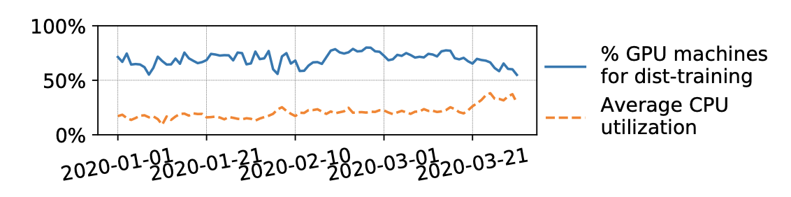

如下图所示，目前的All-Reduce和PS架构在训练性能上距离最优情况都有较大的差距。

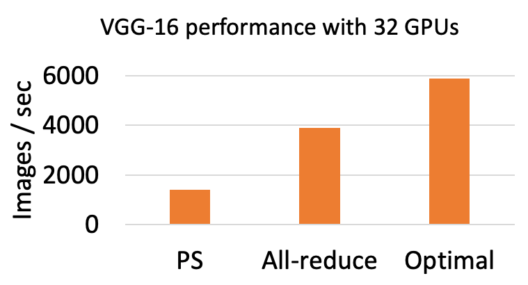

### 1.1 机器间网络通信问题

在异构集群场景下，All-Reduce和PS架构对资源的利用情况如下图所示：

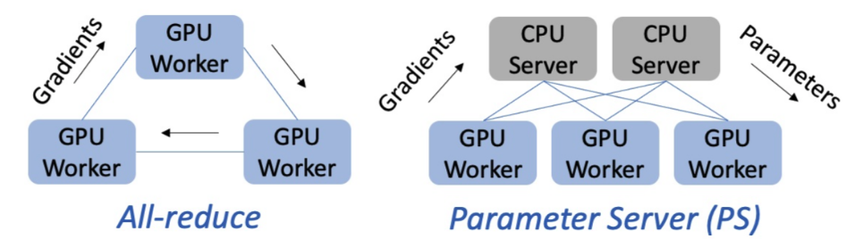

1. All-Reduce架构仅用到GPU机器，这是因为其设计假定了每个节点都是同构节点。迭代过程中，GPU独立计算模型参数的梯度，然后使用All-Reduce通信聚合梯度；
2. PS架构则包含GPU Worker和CPU Server。迭代过程中，GPU Worker将梯度传输至CPU Server；后者将接收到的不同Workers的梯度做聚合，然后执行DNN优化器 (如RMSProp或Adam等)并将更新后的参数传输回GPU Workers。

可以看出，All-Reduce的同构化设计导致其无法充分利用这种异构资源，即只有GPU Workers之间通信，而无法利用其它CPU和带宽资源。而PS虽然能够利用CPU机器作为Server，却可能在CPU Serer数量较少的时候产生流量热点 (例如形成多对一的情况)，从而导致网络拥塞。

### 1.2 机器内多卡PCIe带宽竞争问题

如今一台训练机器通常都具备有多张GPU卡 (例如4或8卡)。在做机器间的通信前，机器内部的多GPU之间需要首先做一次本地通信，该通信过程一般是基于PCIe或NVLink链路。我们观察到，目前的网卡如Mellanox CX5带宽已达100Gbps，已经很接近PCIe 3.0 x16的128Gbps链路带宽。而不幸的是，现在流行的机器内聚合方式 (例如8卡直接做all-reduce)会使PCIe成为瓶颈，导致网卡无法达到其100Gbps带宽上限。即使对含有NVLink的拓扑，我们也能发现类似的PCIe竞争导致的瓶颈问题。

### 1.3 通信链路中的CPU瓶颈问题

从前面的问题1中可以看出，相比于All-reduce而言，PS架构实际上是存在更大的潜力的，因为它能充分利用异构GPU/CPU资源。然而，目前的PS甚至比All-reduce性能显著低 (图2)，似乎与之矛盾。这是因为PS架构中还存在另外一种瓶颈限制了其性能 – CPU瓶颈。顾名思义，PS (参数服务器)需要将参数存储在CPU server上，这就意味着需要将优化器 (如Adam/RMSProp等)放在Server上去执行。然而，优化器通常包含复杂的数学运算，将会消耗大量的CPU内存带宽。在100Gbps的网络输入情况下，CPU将无法满足将完整优化器放置在其上运行的需求。

## 2. BytePS主要设计

针对以上三个问题，BytePS逐一提出了解决方案。

### 2.1 机器间网络通信优化

（1）由前文可知，PS仅利用了GPU机器与CPU机器之间的带宽。在CPU机器数量较少时，GPU机器的带宽B无法充分利用。下图给出了一个例子，在这种情况下，GPU 机器仅能达到2/3的最大带宽，剩余1/3带宽未得到利用。

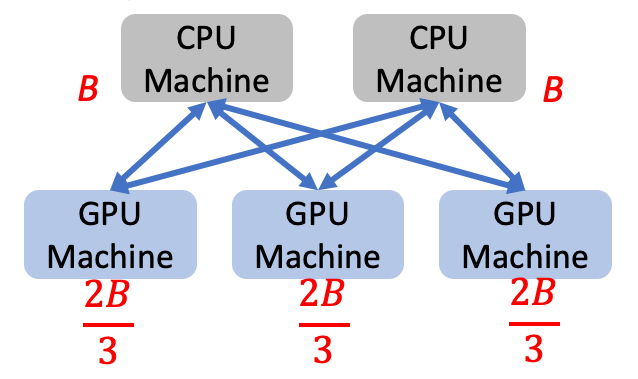

（2）All-reduce仅利用了GPU机器之间的带宽。此时，GPU机器与CPU机器之间的带宽未得到利用。

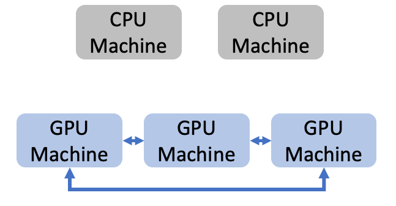

（3）BytePS结合两者之长，同时利用了GPU与GPU之间、GPU与CPU之间的带宽，使得每台机器的带宽都能被充分利用。这就是BytePS机器间通信的思路。

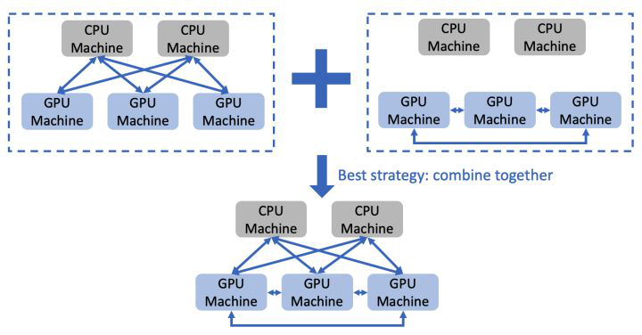

该思路在实现过程中，需要考虑如何分配GPU与GPU之间 (设为x%)、GPU与CPU之间 (设为y%)的流量比例。经过计算，最优比例如下：（其中n为表示GPU机器的数量，k表示CPU机器的数量）

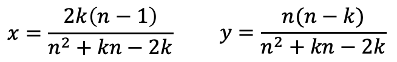

以上即为最优通信策略，对于不同的n与k，采用该策略可使得机器间通信时间最小。

### 2.2 机器内多卡通信优化

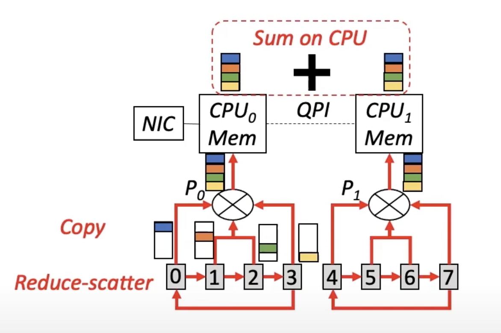

目前市面上主流有两种机器拓扑：PCIe-only型8卡机器和NVLink-based型8卡机器。BytePS针对这两类拓扑提出了通用的解决方案和设计原则。

#### 2.2.1 PCIe-only型拓扑

如下图所示，标记0-7的灰框表示GPU，P0和P1表示PCIe switch。现实当中，P0-CPU0以及P1-CPU1是带宽最小的链路，因此优化目标是最小化这条链路上传输的数据量。目前主流的做法是对这8卡做一次全局All-reduce，这样P0-CPU0需要传输的数据量是7M/4 (根据All-reduce的通信量计算得出)，其中M是每张卡上的梯度大小。注意到该做法并没有利用CPU的计算能力。

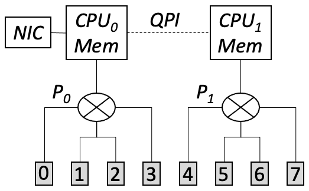

BytePS的核心思想是利用CPU的计算能力减少瓶颈链路的传输数据量。如下图所示，首先每个PCIe switch下的4张卡先进行一次Local Reduce-scatter。该步骤之后，每张卡上已聚合的梯度大小为M/4。

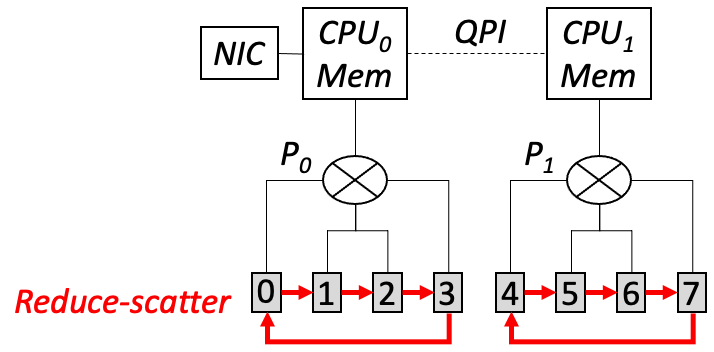

下一步，每张卡将自身已聚合的M/4梯度拷贝到主机的内存上，如下图所示。注意这个过程使得P0-CPU0只传输了M/4*4=M的流量。

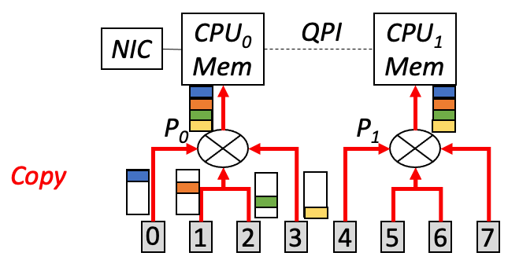

此时，两个NUMA node的主机内存上各自有一份大小为M的梯度。我们再利用CPU将这两份梯度做一次聚合。但是这个过程的传输只发生在带宽较大的QPI上 (>300Gbps)，并不会产生瓶颈。于是这一系列步骤不但实现了预期中的梯度聚合效果，还使瓶颈链路的传输量从7M/4降低为M，显著降低了通信时间。这里的核心设计原则是：尽量避免跨NUMA GPU的直接通信，而可以利用CPU的聚合能力来间接完成。

#### 2.2.2 NVLink-based拓扑

下图是NVLink-based机型的示意图。对于这种拓扑，GPU之间可以通过超高带宽的NVLink链路进行通信。由于NVLink带宽显著大于PCIe带宽，PCIe瓶颈问题显得更加严重。可以看到，下图中P0-CPU0链路 (标红色的线段)会同时被以下两种传输同时竞争：（1）CPU0的内存往GPU0/GPU1拷贝数据；（2）CPU0的内存往网卡NIC发送数据。由于P0-CPU0链路的带宽与网卡带宽很接近，这种竞争会导致网卡无法发挥最大带宽。

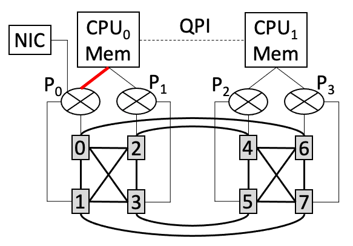

为解决这一竞争问题，BytePS利用了NVLink带宽显著高于PCIe链路的事实，利用Reduce (而非Reduce-scatter)方式避免PCIe竞争。如下图红线所示，所有卡先将其梯度通过NVLink传输至GPU2上并做Reduce，接着GPU2将聚合后的梯度拷贝到CPU0内存，再经由网卡发送出去。由于NVLink带宽很高，这种做法不会导致GPU2产生流量热点问题，但却能够避免在P0-CPU0链路上发生的竞争。

#### 2.2.3 CPU瓶颈优化：Summation Service 

前文提到，优化器对于CPU而言是比较重的任务，这也是PS架构的性能缺陷之一。然而，如何高效利用CPU的异构计算能力是BytePS的核心诉求之一，这就需要克服数据同步过程中的CPU瓶颈。

经分析，优化器可被拆解为两部分：（1）Sum：将来自其他GPU workers的梯度求和并得到一份聚合后的新梯度；（2）Update：利用新梯度对参数进行更新。后者对于CPU而言的确是非常消耗内存带宽的操作，但前者却能够在CPU上高效实现 (例如AVX指令集)。如下图所示，求和操作在CPU上可以达到远超网络带宽的吞吐率，即不会引入CPU瓶颈。

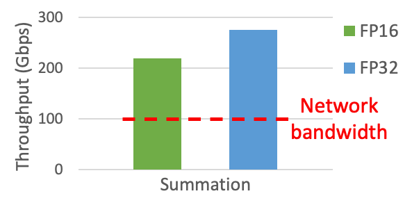

受到这个发现的启发，BytePS提出了Summation Service概念，对传统PS的CPU瓶颈问题做了改进。如下图所示，不同于PS将完整优化器放置在CPU上的设计，Summation Service只将Sum操作放置在CPU上，而将Update操作交由计算能力更强大、内存带宽更充足的GPU来执行。这种设计能够避免同步过程中的CPU瓶颈。

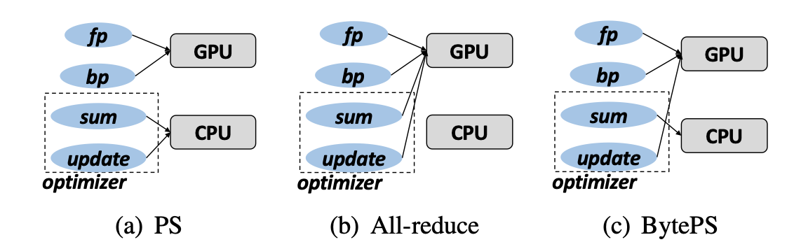

但是这样是否会有过多的context switch从而带来这方面的overhead，作者没有讨论。

## 3. 总体系统架构

将前述BytePS三个设计点结合起来，我们得到BytePS完整系统架构，如下图所示。 

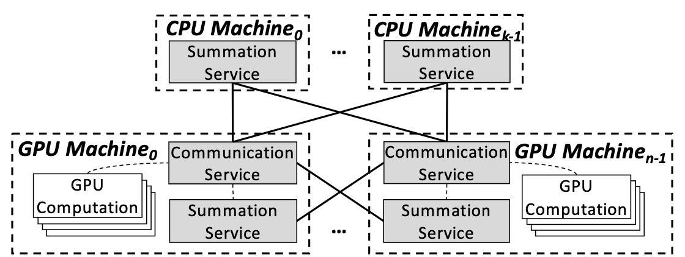

1. 每台GPU机器上部署了一个Communication Service模块，负责聚合本地多卡的梯度 (即机器内多卡通信)，其能充分考虑机器内部复杂的拓扑，避免产生PCIe瓶颈。
2. 每台GPU/CPU机器上部署了一个Summation Service模块，处理来自其他GPU机器的梯度，其能够高效运行在CPU上。
3. 模块之间通过网络互连，通信策略使用的是前述设计中提到的最优网络通信方案。经证明，该方案不仅有最佳的性能，且能够从通信角度统一All-reduce和PS两种架构。

## 4. 系统实现与优化

BytePS在实现中充分利用了流水线的思想，尽可能地将计算和PCIe和网络传输重叠起来。此外，BytePS还利用了一些RDMA实现上的优化技巧 (例如内存页对齐等)，解决了实际部署时遇到的RDMA slow receiver问题，实现了高性能的网络传输。

对于用户侧，BytePS提供了丰富的用户接口，能够兼容TensorFlow，PyTorch和MXNet等主流深度学习框架。通常只需要几行至十几行代码的修改，就可将现有基于其他框架 (如Horovod或PyTorch DDP等)的代码迁移至BytePS上运行。

## 5. 性能评估

BytePS对多种CV类 (包括ResNet-50，VGG-16，GAN)和NLP类 (Transformer，BERT-Large，GPT-2)模型都做了分布式性能评测，规模从8卡 - 256卡。所使用的硬件是V100 GPU和100Gbps RDMA网络。对照组为目前广泛使用的All-reduce和原生PS实现。

下图展示了CV和NLP模型上的评估结果。总体而言，BytePS在各类模型上都取得了正向收益，且相比于All-reduce和PS能够达到的最大提升幅度达84%和245%。

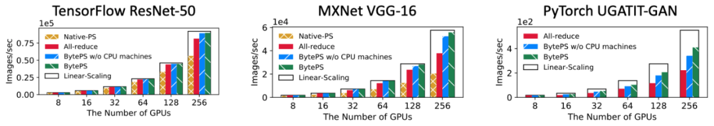

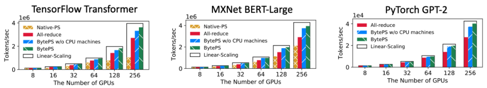